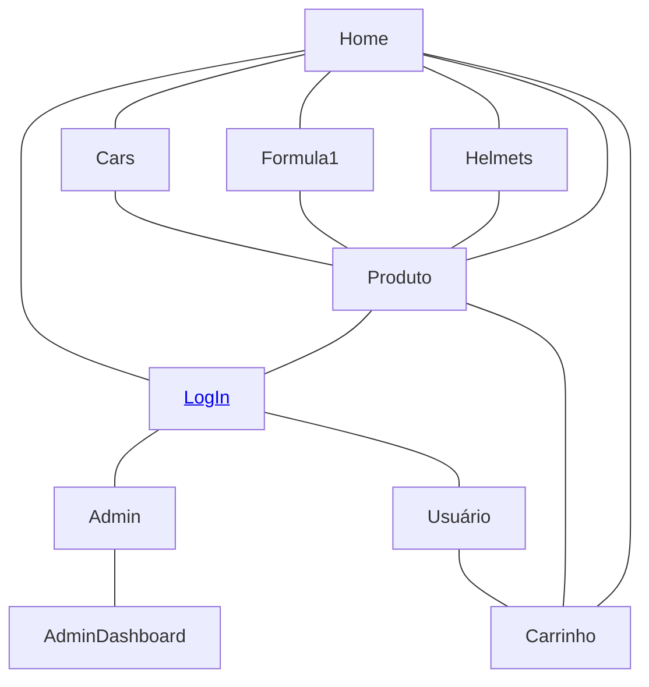

# Ferrari Store

  

### Authors
| Name                                                       | USP number |
| :--------------------------------------------------------- | :--------- |
| [Enzo Tonon Morente](https://github.com/EnzoTM)     | 14568476   |
| [Letícia Barbosa Neves](https://github.com/LeticiaBN) | 14588659   |
| [Pedro Henrique Ferreira Silva](https://github.com/pedrohfsilva)  | 14677526   |

### Website

*Link

### Project Description

The Ferrari Store is an online store for selling collectible items, offering a curated selection of miniature cars and helmets. A must-visit for motorsport enthusiasts, it offers high-quality replicas of Ferrari vehicles and iconic racing helmets, perfect for collectors and fans. As a unique feature, you can even listen to the engine sounds of our car miniatures. Check out the initial website design here: [link].

Describe how your project implements the functionality in the requirements. Diagrams can help a lot here.

### Requirements

Our website supports both customers and administrators, with user and product registration. Customers can select products, choose quantities, and add them to a cart for purchase with a credit card. As a unique feature, we included a system to press a button in the product page and play engine sounds for the car miniatures in our store. All pages are fully responsive.

### Navigation Diagram

### Mockup images (Milestone 1)

*Colocar as imagens do mockup

 

### Comments about the code

### Test Plan

### Test Results

### Build Procedures

### Problems

### Comments

