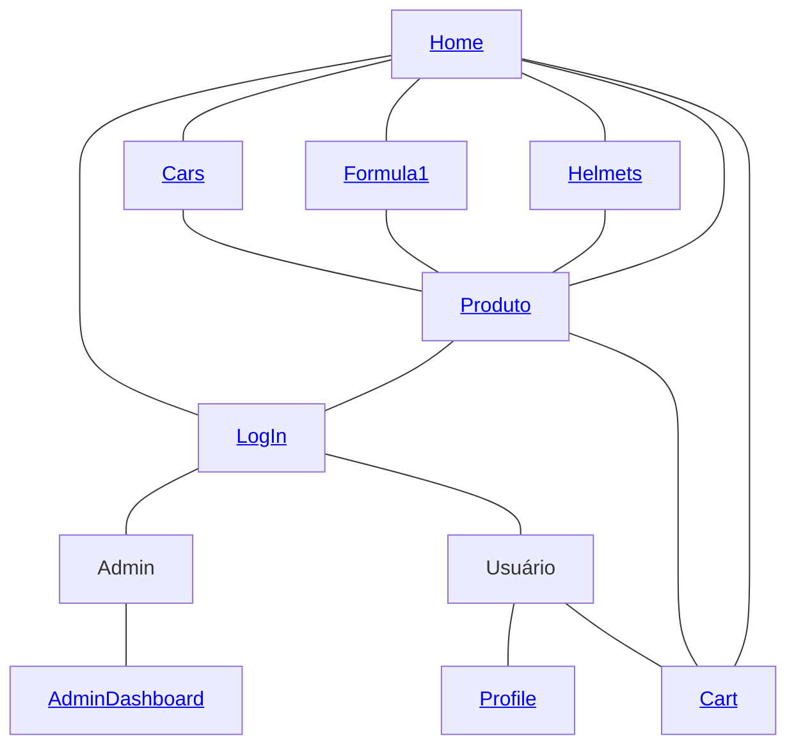

# Ferrari Store

<p align="center">
  
</p>

### Authors
| Name                                                       | USP number |
| :--------------------------------------------------------- | :--------- |
| [Enzo Tonon Morente](https://github.com/EnzoTM)     | 14568476   |
| [Letícia Barbosa Neves](https://github.com/LeticiaBN) | 14588659   |
| [Pedro Henrique Ferreira Silva](https://github.com/pedrohfsilva)  | 14677526   |

### Website

*Link

### Project Description

The Ferrari Store is an online store for selling collectible items, offering a curated selection of miniature cars and helmets. A must-visit for motorsport enthusiasts, it offers high-quality replicas of Ferrari vehicles and iconic racing helmets, perfect for collectors and fans. As a unique feature, you can even listen to the engine sounds of our car miniatures.

### Admin 

Use the following admin credentials to test admin features:

- Login: admin@gmail.com
- Password: admin123

### Requirements

Our website provides comprehensive functionality for both customers and administrators.

**For administrators**, the system offers complete inventory management capabilities, including stock quantity adjustments, product additions and removals, as well as the ability to create new administrative users. All management tools are accessible through an intuitive dashboard.

**For customers**, we provide a full-featured shopping system where users can create personal accounts, browse our product catalog, select desired quantities, and add items to their cart. The checkout process includes credit card payments and delivery address management. Users can also update their profile information at any time.

As the specific functionality, we've implemented an interactive feature that allows customers to hear authentic engine sounds for each car miniature directly on the product page through a dedicated button.

All website pages feature **fully responsive design**, ensuring an optimized user experience across all devices from desktops to smartphones.


### Navigation Diagram




### Mockup images (Milestone 1)

The Mockup images for this site can be found <a href='https://github.com/LeticiaBN/FerrariStore/tree/596a93f7db89f1ddb446b2b4f2ebcaa334f32165/mockups'>here</a>

</br>

### Comments about the code


### Test Plan


### Test Results


### Build Procedures

This project is divided into two parts:

* `frontend` (Next.js)
* `backend` (Node.js)

Follow the steps below to run the application locally.

### Getting Started

#### 1. Open Two Terminals and Navigate to the Project Folders

In the root directory of the project, open **two separate terminals**:

* In Terminal 1:

  ```bash
  cd FerrariStore/frontend
  ```

* In Terminal 2:

  ```bash
  cd FerrariStore/backend
  ```

---

#### 2. Install Dependencies

In **both** terminals, run the following command:

```bash
npm install --force
```

This will install all the required dependencies for both frontend and backend.

---

#### 3. Set Environment Variables

##### In the `frontend` folder:

Create a file named `.env` and add the following:

```
NEXT_PUBLIC_API_URL=http://localhost:5000
```

##### In the `backend` folder:

Create a file named `.env` and add the following:

```
PORT=5000
MONGODB_URI=your_mongodb_connection_string_here
JWT_SECRET=ferrari_secret_jwt_2024
```

Replace `your_mongodb_connection_string_here` with the actual MongoDB URI you'll get in the next step.

---

#### 4. Configure MongoDB Atlas

1. Go to [MongoDB Atlas](https://www.mongodb.com/products/platform/atlas-database).
2. Create an account or log in.
3. Create a new **cluster** (or use an existing one).
4. Click **"Connect"** to get your **MongoDB connection string (URI)**.
5. Copy the URI and paste it in the `.env` file inside the `backend` folder where it says `your_mongodb_connection_string_here`.
6. Go to **Network Access** in MongoDB Atlas.
7. Add your **current IP address** to the list of allowed IPs.

---

#### 5. Run the Project

In both terminals, run:

```bash
npm run dev
```

* The **frontend** will be available at: `http://localhost:3000`
* The **backend** will be running at: `http://localhost:5000`

---

### Problems

### Comments


